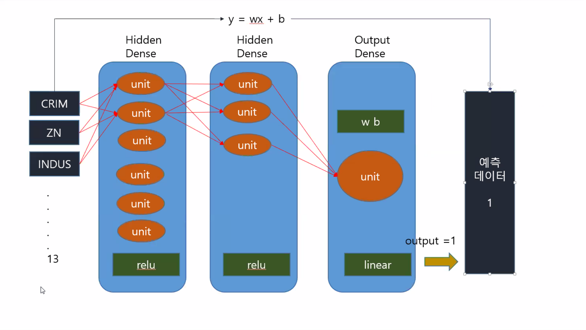

# DeepLearning Practice

>  Kdigital develop intelligent service based on Bigdata program

* [tensorFlow test](./test.py)
* [deep01](./deep01.py)
* [boston](./boston.py)

* [mnist](./mnist.ipynb)
* [fashionmnist](./fashmnist.ipynb)
* [titanic](./titanic.ipynb)

* [imageDL](./p121.ipynb)
* 

